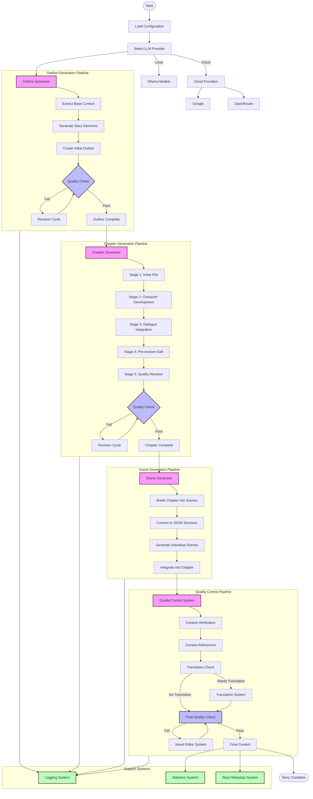

# AI Story Generator System Flow

This flowchart represents the complete system architecture of the AI Story Generator, including:

1. Initial Configuration and Model Selection
2. Outline Generation Pipeline with quality control
3. Chapter Generation Pipeline with its 5-stage process
4. Scene Generation System
5. Quality Control System with content refinement and translation
6. Support Systems integration
7. Final output generation

The flowchart uses different styles to distinguish between:
- Process nodes (pink)
- Decision points (blue)
- Support systems (green)

Each major component is organized into subgraphs for clarity, showing the relationships and data flow between different parts of the system.
